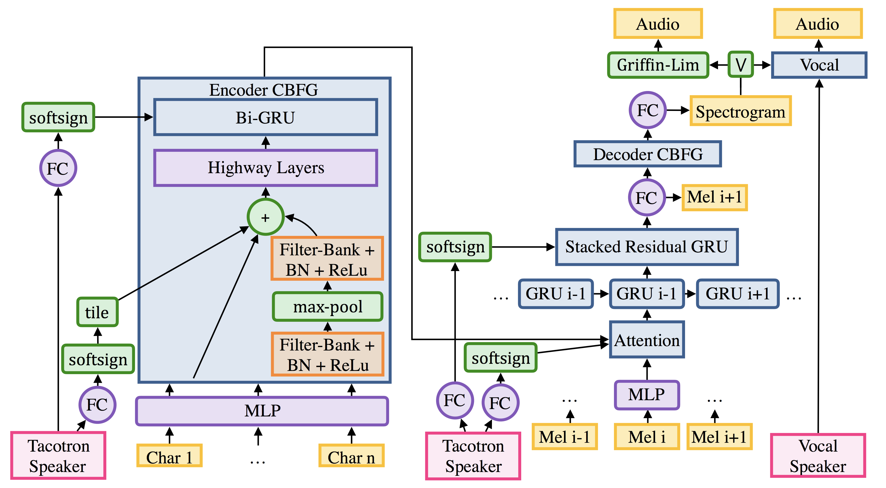

# Multi-Speaker Tacotron in TensorFlow

TensorFlow implementation of:

- [Deep Voice 2: Multi-Speaker Neural Text-to-Speech](https://arxiv.org/abs/1705.08947)
- [Listening while Speaking: Speech Chain by Deep Learning](https://arxiv.org/abs/1707.04879)
- [Tacotron: Towards End-to-End Speech Synthesis](https://arxiv.org/abs/1703.10135)

## Prerequisites

- Python 3.6+
- FFmpeg
- [Tensorflow 1.3](https://www.tensorflow.org/install/)

## Usage

### 1. Install prerequisites

After preparing [Tensorflow](https://www.tensorflow.org/install/), install prerequisites with:

    pip3 install -r requirements.txt
    python -c "import nltk; nltk.download('punkt')"

### 2-1. Generate custom datasets

The `datasets` directory should look like:

    datasets
    ├── speaker
    └── YOUR_DATASET
        ├── alignment.json
        └── audio
            ├── 1.mp3
            ├── 2.mp3
            ├── 3.mp3
            └── ...

and `YOUR_DATASET/alignment.json` should look like:

    {
        "./datasets/YOUR_DATASET/audio/001.mp3": ["My name is Taehoon Kim."],
        "./datasets/YOUR_DATASET/audio/002.mp3": ["The buses aren't the problem."],
        "./datasets/YOUR_DATASET/audio/003.mp3": ["They have discovered a new particle."],
    }

### 2-2. Generate numpy files which will be used in training.

After you organize your data and sample to the rate defined in your hparams, you should generate preprocessed data with:

    python3 -m datasets.generate_data ./datasets/YOUR_DATASET/alignment.json

### 3. Train a model

The important hyperparameters for a models are defined in `hparams.py`.

(**Keep `cleaners` in `hparams.py` as `english_cleaners` to train with English dataset**)

To train a single-speaker model:

    python3 train.py --data_path=datasets/YOUR_DATASET
    python3 train.py --data_path=datasets/YOUR_DATASET --initialize_path=PATH_TO_CHECKPOINT

To train a multi-speaker model:

    # after change `model_type` in `hparams.py` to `deepvoice` or `simple`
    python3 train.py --data_path=datasets/FOlDER_1,datasets/FOLDER_2,datasets/FOLDER_3

To restart a training from previous experiments such as `logs/YOUR_DATASET-20171015`:

    python3 train.py --data_path=datasets/YOUR_DATASET --load_path logs/YOUR_DATASET-20171015

If you don't have good and enough (10+ hours) dataset, it would be better to use `--initialize_path` to use a well-trained model as initial parameters.

### 4. Synthesize audio

You generate audio directly with:

    GPU=1 ; python3 synthesizer.py --load_path logs/$RUN_DIR  --num_speakers=2 --speaker_id=0 --checkpoint_step=82000 --text="Dec eighteen schatz five give six in a yard"

Or do a pretty demo using:

    python3 app.py --load_path logs/YOUR_DATASET-20171015 --num_speakers=1